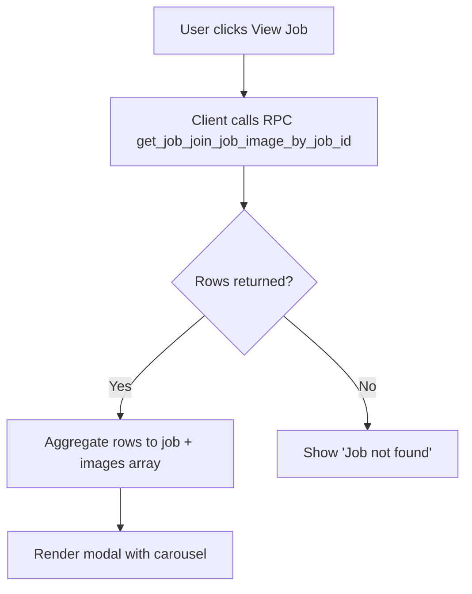

# Software Design & Analysis Document (SDAD)
Job Match Up — DBMS Final Project

I. Introduction
1.1 Project Overview & UN SDG Target
- Overview: Job Match Up is a mobile-friendly, role-based job platform connecting job listers and job seekers through a structured interface and Supabase-driven backend logic.
- UN SDG Target: SDG 8 — Decent Work and Economic Growth. The system facilitates access to job opportunities, improves transparency in informal labor markets, and supports dignified employment.

1.2 Problem Statement
- Real-world data problem: Matching local job supply and demand is fragmented, often relying on informal channels (word of mouth, social media) with poor data quality and discoverability. This system consolidates postings and applications, normalizes job data (categories, images, salaries), and provides reliable search and transactional operations.

II. Requirements & Analysis
2.1 Functional Requirements (FR) and Non-Functional Requirements (NFR)
- FR1: User authentication and session handling (login/register) with role redirection (admin, job_lister, job_seeker) [js/comp/login-form.js:162–178].
- FR2: Browse published jobs with pagination [js/comp/job-grid.js:116–154; js/db-logic/job-handler.js:10–86].
- FR3: View job details with images using RPC `get_job_join_job_image_by_job_id` [js/db-logic/job-handler.js:141–195; dashboards use it in details view].
- FR4: Search jobs by title, location, category, salary range, work type [index.html:120–269; dashboard-job-seeker.html:454–483].
- FR5: Job lister posts jobs with images atomically [js/db-logic/job-lister-handler.js:38–61].
- FR6: Admin reviews/approves/rejects pending jobs [js/db-logic/admin-handler.js].
- FR7: Job seeker applies to jobs with resume linkage [js/comp/job-details-seeker.js:69–110; js/db-logic/seeker-handler.js].
- FR8: Mobile-friendly UI with hamburger sidebar and responsive grids [js/comp/navbar.js; js/comp/job-grid.js:71–87].

- NFR1: Performance — pagination for lists; single-RPC aggregation for details.
- NFR2: Security — client-safe keys only, DB constraints/triggers for integrity.
- NFR3: Usability — responsive layouts, accessible controls, clear flows.
- NFR4: Reliability — transactional procedures ensure atomicity; sanitized selectors prevent runtime errors.
- NFR5: Maintainability — modular Web Components, RPC wrappers per domain.

2.2 Data Requirements
- Input structures:
  - Jobs: id (UUID), title (text), category (enum-like text), description (text), location (text), rate_amount (numeric), rate_type (text), salary_notes (text), status (text), work_type (text), work_schedule (text), vacancies_available (int), required_skills (text), lister_id (UUID), timestamps.
  - Job Images: id (UUID), job_id (UUID FK), file_url (text), caption (text), display_order (int), created_at.
  - Applications: id (UUID), job_id (UUID FK), seeker_id (UUID FK), status (text), cover_letter (text), created_at.
  - Resume: id (UUID), user_id (UUID FK), title (text), summary (text), file_url (text).
- Typical sizes: lists paginate at 12 items/page; images per job capped (e.g., ≤10).

2.3 Schema Normalization Analysis
- Jobs(job_id → all attributes). No partial or transitive dependencies if keys are single-column UUIDs. 3NF satisfied; likely BCNF assuming no non-key determinants (e.g., category text does not determine other attributes).
- JobImages(image_id → file_url, caption, display_order, job_id, created_at). 3NF; BCNF if image_id is the only determinant. job_id does not determine image attributes uniquely (one-to-many).
- Applications(application_id → job_id, seeker_id, status, cover_letter, created_at). 3NF; status changes do not determine other non-key attributes; BCNF with UUID PK.
- Users(user_id → role, email, name, status...). 3NF; email unique constraint recommended; BCNF if no non-key determinants.

Functional Dependencies (examples):
- Jobs: job_id → title, category, description, location, rate_amount, rate_type, status, work_type, work_schedule, vacancies_available, required_skills, lister_id, created_at, updated_at
- JobImages: image_id → job_id, file_url, caption, display_order, created_at
- Applications: application_id → job_id, seeker_id, status, cover_letter, created_at

III. Design Specification
3.1 Core DBMS Concepts Used (Five)
A. Stored Procedures (RPC)
- Justification: Encapsulate business logic server-side; enable atomic operations and role-guarded access; reduce client complexity.
- Implementation: Representative SQL
```sql
-- get_published_jobs_paginated
create or replace function get_published_jobs_paginated(p_page int, p_page_size int)
returns table (
  id uuid,
  title text,
  location text,
  rate_amount numeric,
  rate_type text,
  salary_notes text,
  category text,
  work_type text,
  total_count int,
  total_pages int
)
language sql as $$
  with base as (
    select j.*, count(*) over() as total_count
    from jobs j
    where j.status = 'published'
    order by j.created_at desc
    limit p_page_size offset (p_page - 1) * p_page_size
  )
  select
    base.id, base.title, base.location, base.rate_amount, base.rate_type,
    base.salary_notes, base.category, base.work_type,
    base.total_count,
    ceil(base.total_count::numeric / p_page_size)::int as total_pages
  from base;
$$;

-- get_job_join_job_image_by_job_id
create or replace function get_job_join_job_image_by_job_id(p_job_id uuid)
returns table (
  job_id uuid, lister_id uuid, title text, description text, category text,
  work_type text, location text, work_schedule text, rate_amount numeric,
  rate_type text, salary_notes text, vacancies_available int,
  required_skills text, status text, job_created_at timestamptz, job_updated_at timestamptz,
  image_id uuid, file_url text, caption text, display_order int, image_created_at timestamptz
)
language sql as $$
  select
    j.id as job_id, j.lister_id, j.title, j.description, j.category,
    j.work_type, j.location, j.work_schedule, j.rate_amount,
    j.rate_type, j.salary_notes, j.vacancies_available,
    j.required_skills, j.status, j.created_at as job_created_at, j.updated_at as job_updated_at,
    i.id as image_id, i.file_url, i.caption, i.display_order, i.created_at as image_created_at
  from jobs j
  left join job_images i on i.job_id = j.id
  where j.id = p_job_id;
$$;

-- get_job_by_filter (simplified)
create or replace function get_job_by_filter(
  p_title text, p_location text, p_category text,
  p_min_salary numeric, p_max_salary numeric, p_work_type text,
  p_limit int, p_offset int
)
returns table (id uuid) language sql as $$
  select j.id
  from jobs j
  where j.status = 'published'
    and (p_title is null or j.title ilike '%'||p_title||'%')
    and (p_location is null or j.location ilike '%'||p_location||'%')
    and (p_category is null or j.category = p_category)
    and (p_min_salary is null or j.rate_amount >= p_min_salary)
    and (p_max_salary is null or j.rate_amount <= p_max_salary)
    and (p_work_type is null or j.work_type = p_work_type)
  order by j.created_at desc
  limit coalesce(p_limit, 12) offset coalesce(p_offset, 0);
$$;
```

B. Transactions
- Justification: Ensure atomic creation of jobs with images; prevent partial writes.
- Implementation:
```sql
create or replace function add_job_with_images(
  p_title text, p_category text, p_description text,
  p_images jsonb, p_lister_id uuid, p_location text,
  p_rate_amount numeric, p_rate_type text, p_required_skills text,
  p_salary_notes text, p_status text, p_vacancies_available int,
  p_work_schedule text, p_work_type text
) returns jsonb language plpgsql as $$
declare v_job_id uuid := gen_random_uuid();
begin
  begin
    insert into jobs(id, title, category, description, lister_id, location,
      rate_amount, rate_type, required_skills, salary_notes, status,
      vacancies_available, work_schedule, work_type)
    values (v_job_id, p_title, p_category, p_description, p_lister_id, p_location,
      p_rate_amount, p_rate_type, p_required_skills, p_salary_notes, coalesce(p_status,'pending_approval'),
      coalesce(p_vacancies_available,1), p_work_schedule, p_work_type);

    if p_images is not null then
      insert into job_images(id, job_id, file_url, caption, display_order)
      select gen_random_uuid(), v_job_id,
             (img->>'file_url')::text,
             (img->>'caption')::text,
             coalesce((img->>'display_order')::int, 0)
      from jsonb_array_elements(p_images) as img;
    end if;

    return jsonb_build_object('message','ok','job_id',v_job_id);
  exception when others then
    rollback;
    raise;
  end;
end;
$$;
```

C. Views (optional but recommended)
- Justification: Pre-joined views simplify reporting and admin dashboards.
- Implementation:
```sql
create or replace view published_jobs_with_images as
select j.*, i.id as image_id, i.file_url, i.caption, i.display_order
from jobs j left join job_images i on i.job_id = j.id
where j.status = 'published';
```

D. Constraints
- Justification: Enforce domain rules (rate_amount ≥ 0, valid statuses).
```sql
alter table jobs add constraint chk_rate_amount_nonnegative check (rate_amount >= 0);
alter table jobs add constraint chk_job_status check (status in ('draft','pending_approval','published','rejected'));
```

E. Triggers
- Justification: Guard destructive operations; auto-manage timestamps.
```sql
create or replace function prevent_delete_published_job()
returns trigger language plpgsql as $$
begin
  if old.status = 'published' then
    raise exception 'Cannot delete published job';
  end if;
  return old;
end;
$$;

create trigger trg_prevent_delete_published
before delete on jobs
for each row execute function prevent_delete_published_job();

create or replace function set_updated_at()
returns trigger language plpgsql as $$
begin
  new.updated_at := now();
  return new;
end;
$$;

create trigger trg_set_updated_at
before update on jobs
for each row execute function set_updated_at();
```

3.2 ER Diagram (Conceptual/Logical/Physical)
- Key Entities: Users, Jobs, JobImages, Applications, Resume
- Cardinalities:
  - Users 1—N Jobs
  - Jobs 1—N JobImages
  - Users 1—N Applications; Jobs 1—N Applications
  - Users 1—1 Resume (optional)
- Physical keys: UUID primary keys; FKs on job_id, user_id.

3.3 Transaction Flowchart (FR3 — details + images)


IV. Testing and Results (Optional)
4.1 Test Cases
- TC1: Filter Search
  - Input: title='Driver', location='Makati', category='Drayber (Family Driver / Delivery Driver)'
  - Expected: Jobs matching criteria only; pagination count reflects total pages.
- TC2: Details Fetch
  - Input: job_id = known published job
  - Expected: Details modal shows images carousel; at least one image displayed.
- TC3: Trigger Failure
  - Operation: delete from jobs where id=<published_job_id>
  - Expected: ERROR "Cannot delete published job" from `trg_prevent_delete_published`.

4.2 ACID Compliance Test (Atomicity via ROLLBACK)
- Procedure: Wrap add_job_with_images in a transaction; inject a failure in image insert.
- Expected: No job or images persisted; database remains consistent.

V. Conclusion and Contributions
5.1 Conclusion
- The system demonstrates a maintainable, mobile-first job platform leveraging DBMS best practices: normalized schema, RPC-based server logic, transactions, and constraints.

5.2 Individual Contributions
- Member A: Frontend components (navbar, job grid, job cards).
- Member B: Stored procedures and RPC integration (jobs, lister).
- Member C: Seeker workflows (apply, resume).
- Member D: Admin workflows (pending approvals).
- Member E: Responsive styling and accessibility refinements.

Appendix
- Code References (examples):
  - `js/db-logic/job-handler.js:14` — get_published_jobs_paginated
  - `js/db-logic/job-handler.js:144` — get_job_join_job_image_by_job_id
  - `js/comp/job-grid.js:71–87` — mobile grid breakpoints
  - `js/comp/job-details.js:198–207` — carousel conversion
  - `dashboard-job-seeker.html:343` — sanitize sectionId